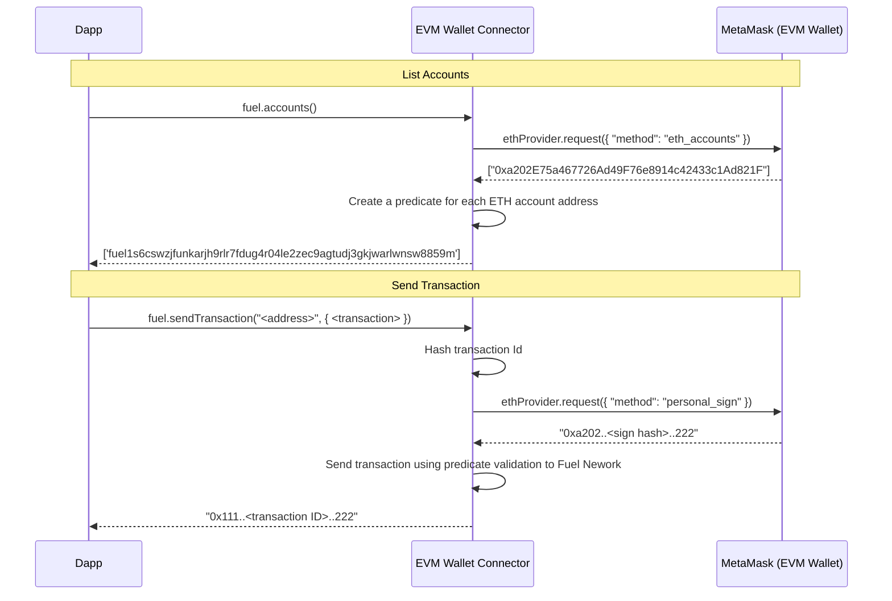

# Fuel Wallet Connector for MetaMask

This Connector is part of the effort to enable users to use their current **MetaMask Wallet**,
to sign transactions on Fuel Network.

> **Warning**
> This project is under active development, the current version of the `@fuel-wallet/sdk` is not compatible with the new Connectors.

## 📗 Table of contents

- [📗 About EVM Connector](#📗-description)
- [🧑‍💻 Getting Started](#🧑‍💻-getting-started)
- [🧰 Examples](./examples/)
- 🗂️ Project
    - [Predicate](./packages/signature-verification/)
    - [EVM Wallet Connector](./packages/wallet-connector-evm/)
- [📜 License](#📜-license)

## 📗 Description

The Connector follows the new standard for Fuel compatible [Wallet Connectors](https://github.com/FuelLabs/fuels-wallet/wiki/Fuel-Wallet-Connectors), creating a more integrated ecosystem.

To enable the use of a MetaMask wallet on Fuel we use [Predicates](https://docs.fuel.network/docs/intro/glossary/#predicate) on Fuel Network, that allow transactions to be validated using a script.

Bellow we share a model that explains how our EVM Connector works.



## 🧑‍💻 Getting Started

### Install

```sh
npm install @fuels/wallet-connector-evm @fuel-wallet/sdk@0.14.0-preview-ce33146
```

### Using

```ts
import { Fuel, defaultConnectors } from '@fuel-wallet/sdk';
import { EVMWalletConnector } from '@fuels/wallet-connector-evm';

const fuel = new Fuel({
  connectors: [
    // Also show other connectors like Fuel Wallet
    ...defaultConnectors(),
    new EVMWalletConnector()
  ]
});

await fuel.selectConnector('EVM wallet connector');
const connection = await fuel.connect();
console.log(connection);
```

## 🚧 Development

### Building the project

```sh
pnpm build:all
```

### Tests

#### Predicate

```sh
cd packages/signature-verification
forc build
cargo test
```

#### EVM Wallet Connector

```sh
cd packages/wallet-connector-evm
pnpm test
```

## 📜 License

This repo is licensed under the `Apache-2.0` license. See [`LICENSE`](./LICENSE) for more information.
